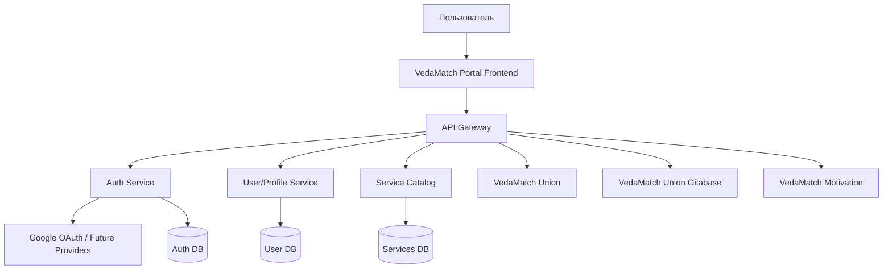
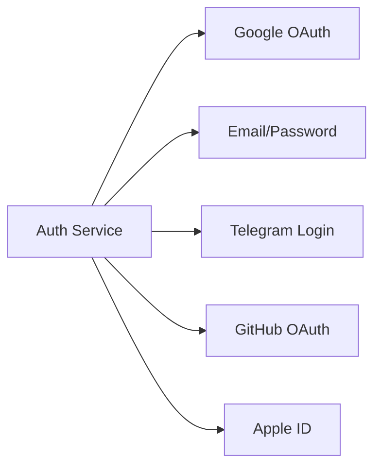

# План портала VedaMatch

## 1. Цель портала

**VedaMatch Portal** — единая точка входа для всех сервисов экосистемы VedaMatch:

- VedaMatch Union
- VedaMatch Union Gitabase
- VedaMatch Motivation
- будущие сервисы VedaMatch

Главная идея: пользователь один раз авторизуется и получает удобный доступ ко всем доступным ему сервисам.

---

## 2. Основные требования

### Пользовательские требования

- Единый вход во все сервисы.
- Авторизация через **Google OAuth** на первом этапе.
- Возможность добавить другие способы авторизации в будущем:
  - email/password;
  - Telegram;
  - Apple ID;
  - GitHub;
  - корпоративный SSO.
- Удобная главная страница со списком сервисов.
- Адаптивный дизайн под:
  - мобильные телефоны;
  - планшеты;
  - десктоп.
- Простая и понятная навигация.
- Отображение только тех сервисов, которые доступны конкретному пользователю.

---

## 3. Архитектура

---

## 4. Основные микросервисы

### 4.1 VedaMatch Portal Frontend

Веб-приложение, через которое пользователь входит в систему и открывает сервисы.

Функции:

- экран входа;
- вход через Google;
- главная страница с карточками сервисов;
- профиль пользователя;
- адаптивный интерфейс;
- отображение доступных сервисов;
- переход в нужный сервис без повторного входа.

### 4.2 API Gateway

Единая точка входа для frontend-приложения.

Функции:

- маршрутизация запросов к микросервисам;
- проверка токенов;
- rate limit;
- централизованное логирование;
- защита внутренних сервисов.

### 4.3 Auth Service

Сервис единой авторизации.

Функции:

- Google OAuth;
- выдача JWT/access token;
- refresh token;
- управление сессиями;
- поддержка будущих провайдеров авторизации;
- logout из всех сервисов;
- единый SSO для всех сервисов VedaMatch.

### 4.4 User/Profile Service

Сервис пользовательских данных.

Хранит:

- имя;
- email;
- avatar;
- роль;
- список доступных сервисов;
- настройки пользователя.

### 4.5 Service Catalog

Сервис каталога приложений VedaMatch.

Хранит информацию о сервисах:

- название;
- описание;
- иконка;
- URL;
- статус сервиса;
- кому доступен сервис;
- категория сервиса.

---

## 5. Единая авторизация

Рекомендуемая схема:

1. Пользователь открывает портал VedaMatch.
2. Нажимает **Войти через Google**.
3. Auth Service получает данные от Google.
4. Создается или обновляется пользователь.
5. Пользователь получает токены.
6. Portal показывает список доступных сервисов.
7. При переходе в сервис токен передается через безопасный SSO-механизм.

Будущая схема провайдеров авторизации:

---

## 6. Дизайн портала

### Общий стиль

- простой;
- чистый;
- современный;
- без перегруженного интерфейса;
- с акцентом на быстрый доступ к сервисам.

### Главная страница

Блоки:

1. Верхняя панель:
   - логотип VedaMatch;
   - имя пользователя;
   - аватар;
   - кнопка выхода.
2. Приветственный блок:
   - “Добро пожаловать в VedaMatch”;
   - короткое описание портала.
3. Сетка сервисов:
   - карточка сервиса;
   - иконка;
   - название;
   - описание;
   - кнопка “Открыть”.
4. Будущие сервисы:
   - отображение в статусе “Скоро”.

---

## 7. Мобильная адаптация

На мобильных устройствах:

- карточки сервисов идут в одну колонку;
- меню сворачивается;
- кнопки крупные и удобные для касания;
- быстрый доступ к профилю;
- минимум лишнего текста;
- авторизация в 1–2 клика.

---

## 8. Безопасность

Нужно предусмотреть:

- HTTPS везде;
- JWT с коротким сроком жизни;
- refresh token в httpOnly cookie;
- защиту от CSRF;
- защиту от XSS;
- ограничение попыток входа;
- централизованный logout;
- аудит входов;
- разделение прав доступа;
- роли: `user`, `admin`, `service-admin`.

---

## 9. Админ-панель

В будущем можно добавить admin-раздел.

Функции:

- управление пользователями;
- управление доступами к сервисам;
- добавление новых сервисов;
- включение/отключение сервисов;
- просмотр логов входа;
- настройка OAuth-провайдеров.

---

## 10. Этапы разработки

### Этап 1 — MVP

- Frontend Portal.
- Google OAuth.
- Auth Service.
- User Service.
- Service Catalog.
- Список сервисов.
- Переход в сервисы.
- Адаптивный дизайн.

### Этап 2 — SSO

- Единая авторизация между сервисами.
- Refresh token.
- Logout из всех сервисов.
- Роли и доступы.

### Этап 3 — Расширение

- Новые способы авторизации.
- Админ-панель.
- Управление сервисами.
- Уведомления.
- Аудит действий.

### Этап 4 — Production

- Мониторинг.
- Логирование.
- Backup.
- CI/CD.
- Защита API.
- Масштабирование микросервисов.

---

## 11. Рекомендуемые компоненты

- **VedaMatch Portal** — frontend-приложение.
- **VedaMatch Auth** — единая авторизация.
- **VedaMatch Gateway** — API Gateway.
- **VedaMatch Users** — пользователи и профили.
- **VedaMatch Services Catalog** — каталог сервисов.
- **VedaMatch Admin** — будущая админ-панель.

---

## 12. Итоговая концепция

**VedaMatch Portal** должен быть центральным, простым и безопасным входом во всю экосистему VedaMatch.

Главный принцип:

> Один аккаунт — один вход — доступ ко всем сервисам VedaMatch.
