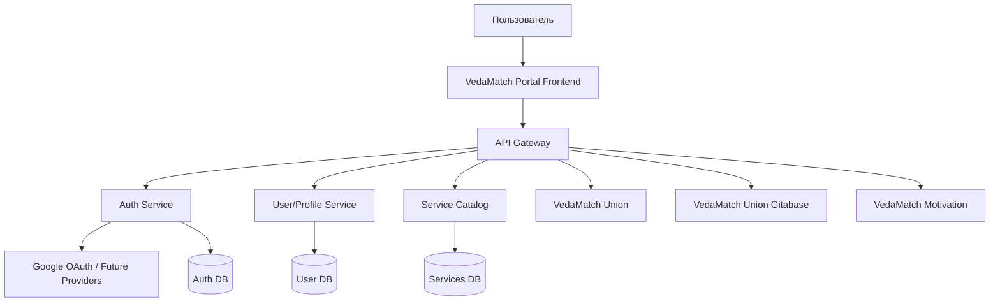
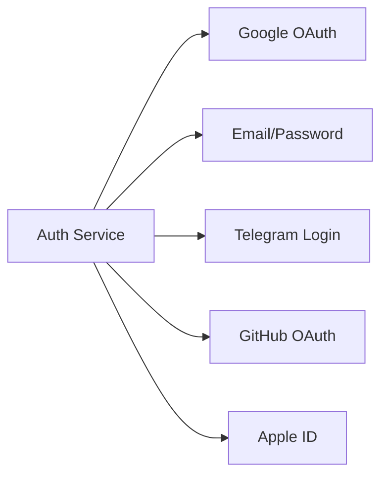

# План портала VedaMatch

## 1. Цель портала

**VedaMatch Portal** — единая точка входа для всех сервисов экосистемы VedaMatch:

- VedaMatch Union
- VedaMatch Union Gitabase
- VedaMatch Motivation
- будущие сервисы VedaMatch

Главная идея: пользователь один раз авторизуется и получает удобный доступ ко всем доступным ему сервисам.

---

## 2. Основные требования

### Пользовательские требования

- Единый вход во все сервисы.
- Авторизация через **Google OAuth** на первом этапе.
- Возможность добавить другие способы авторизации в будущем:
  - email/password;
  - Telegram;
  - Apple ID;
  - GitHub;
  - корпоративный SSO.
- Удобная главная страница со списком сервисов.
- Адаптивный дизайн под:
  - мобильные телефоны;
  - планшеты;
  - десктоп.
- Простая и понятная навигация.
- Отображение только тех сервисов, которые доступны конкретному пользователю.

---

## 3. Архитектура



---

## 4. Основные микросервисы

### 4.1 VedaMatch Portal Frontend

Веб-приложение, через которое пользователь входит в систему и открывает сервисы.

Функции:

- экран входа;
- вход через Google;
- главная страница с карточками сервисов;
- профиль пользователя;
- адаптивный интерфейс;
- отображение доступных сервисов;
- переход в нужный сервис без повторного входа.

### 4.2 API Gateway

Единая точка входа для frontend-приложения.

Функции:

- маршрутизация запросов к микросервисам;
- проверка токенов;
- rate limit;
- централизованное логирование;
- защита внутренних сервисов.

### 4.3 Auth Service

Сервис единой авторизации.

Функции:

- Google OAuth;
- выдача JWT/access token;
- refresh token;
- управление сессиями;
- поддержка будущих провайдеров авторизации;
- logout из всех сервисов;
- единый SSO для всех сервисов VedaMatch.

### 4.4 User/Profile Service

Сервис пользовательских данных.

Хранит:

- имя;
- email;
- avatar;
- роль;
- список доступных сервисов;
- настройки пользователя.

### 4.5 Service Catalog

Сервис каталога приложений VedaMatch.

Хранит информацию о сервисах:

- название;
- описание;
- иконка;
- URL;
- статус сервиса;
- кому доступен сервис;
- категория сервиса.

---

## 5. Единая авторизация

Рекомендуемая схема:

1. Пользователь открывает портал VedaMatch.
2. Нажимает **Войти через Google**.
3. Auth Service получает данные от Google.
4. Создается или обновляется пользователь.
5. Пользователь получает токены.
6. Portal показывает список доступных сервисов.
7. При переходе в сервис токен передается через безопасный SSO-механизм.

Будущая схема провайдеров авторизации:



---

## 6. Дизайн портала

### Общий стиль

- простой;
- чистый;
- современный;
- без перегруженного интерфейса;
- с акцентом на быстрый доступ к сервисам.

### Главная страница

Блоки:

1. Верхняя панель:
   - логотип VedaMatch;
   - имя пользователя;
   - аватар;
   - кнопка выхода.
2. Приветственный блок:
   - “Добро пожаловать в VedaMatch”;
   - короткое описание портала.
3. Сетка сервисов:
   - карточка сервиса;
   - иконка;
   - название;
   - описание;
   - кнопка “Открыть”.
4. Будущие сервисы:
   - отображение в статусе “Скоро”.

---

## 7. Мобильная адаптация

На мобильных устройствах:

- карточки сервисов идут в одну колонку;
- меню сворачивается;
- кнопки крупные и удобные для касания;
- быстрый доступ к профилю;
- минимум лишнего текста;
- авторизация в 1–2 клика.

---

## 8. Безопасность

Нужно предусмотреть:

- HTTPS везде;
- JWT с коротким сроком жизни;
- refresh token в httpOnly cookie;
- защиту от CSRF;
- защиту от XSS;
- ограничение попыток входа;
- централизованный logout;
- аудит входов;
- разделение прав доступа;
- роли: `user`, `admin`, `service-admin`.

---

## 9. Админ-панель

В будущем можно добавить admin-раздел.

Функции:

- управление пользователями;
- управление доступами к сервисам;
- добавление новых сервисов;
- включение/отключение сервисов;
- просмотр логов входа;
- настройка OAuth-провайдеров.

---

## 10. Этапы разработки

### Этап 1 — MVP

- Frontend Portal.
- Google OAuth.
- Auth Service.
- User Service.
- Service Catalog.
- Список сервисов.
- Переход в сервисы.
- Адаптивный дизайн.

### Этап 2 — SSO

- Единая авторизация между сервисами.
- Refresh token.
- Logout из всех сервисов.
- Роли и доступы.

### Этап 3 — Расширение

- Новые способы авторизации.
- Админ-панель.
- Управление сервисами.
- Уведомления.
- Аудит действий.

### Этап 4 — Production

- Мониторинг.
- Логирование.
- Backup.
- CI/CD.
- Защита API.
- Масштабирование микросервисов.

---

## 11. Рекомендуемые компоненты

- **VedaMatch Portal** — frontend-приложение.
- **VedaMatch Auth** — единая авторизация.
- **VedaMatch Gateway** — API Gateway.
- **VedaMatch Users** — пользователи и профили.
- **VedaMatch Services Catalog** — каталог сервисов.
- **VedaMatch Admin** — будущая админ-панель.

---

## 12. Итоговая концепция

**VedaMatch Portal** должен быть центральным, простым и безопасным входом во всю экосистему VedaMatch.

Главный принцип:

> Один аккаунт — один вход — доступ ко всем сервисам VedaMatch.

---

## 13. Самоидентификация пользователя после регистрации

### 13.1 Назначение

После регистрации пользователь проходит самоидентификацию, чтобы портал мог:

- определить его текущий этап пути;
- подобрать подходящие сервисы, проекты, материалы и события;
- управлять доступом к разделам портала;
- помогать пользователю развиваться постепенно;
- подтверждать статус “Преданный” через наставника и администратора.

Важно: этап пользователя — это не ранг и не оценка, а **текущий этап пути**.

### 13.2 Этапы пользователя

#### 1. Ищущий

Человек интересуется самоосознанием, духовностью, смыслом жизни, но пока только начинает путь.

#### 2. Практикующий основы

Человек знаком с базовыми принципами самоосознания и старается применять их в жизни.

#### 3. Йог

Человек регулярно и серьезно практикует, стремится к углублению практики.

#### 4. Преданный

Человек серьезно следует духовной практике, может иметь духовное имя, наставника, связь с общиной и служением.

### 13.3 Как определяется этап

Пользователь **не выбирает этап напрямую**. Он отвечает на вопросы анкеты, а система на основе ответов определяет подходящий этап.

Пример логики:

- ответы начального уровня → **Ищущий**;
- базовая практика и интерес → **Практикующий основы**;
- регулярная серьезная практика → **Йог**;
- наставник, духовное имя, служение, община → **Преданный / кандидат на подтверждение**.

### 13.4 Анкета после регистрации

Примеры вопросов:

1. Как бы вы описали свой интерес к самоосознанию?
2. Есть ли у вас регулярная духовная практика?
3. Что вам сейчас ближе всего?
4. Есть ли у вас наставник?
5. Есть ли связь с духовной общиной?
6. Есть ли у вас духовное имя?
7. Участвуете ли вы в служении?
8. Хотите ли вы получать рекомендации по развитию?

### 13.5 Подтверждение статуса “Преданный”

Статус “Преданный” дает доступ к закрытым сервисам **только после подтверждения администратором**.

Процесс:

1. Пользователь проходит анкету.
2. Система определяет его как “Преданный” или кандидат на этот статус.
3. Пользователь получает уникальную ссылку для наставника.
4. Пользователь отправляет ссылку наставнику.
5. Наставник без регистрации заполняет форму.
6. Система сохраняет данные наставника для связи.
7. Администратор проверяет заявку.
8. После подтверждения пользователь получает доступ к закрытым сервисам.

### 13.6 Форма наставника

Наставник не обязан быть зарегистрирован на портале.

Собираемые данные:

- имя наставника;
- телефон;
- email;
- город/община;
- как давно знает пользователя;
- знает ли пользователя лично;
- есть ли у пользователя регулярная практика;
- есть ли служение;
- есть ли духовное имя;
- есть ли связь с общиной;
- характеристика пользователя;
- рекомендация подтвердить статус;
- подтверждение достоверности данных.

### 13.7 Статусы подтверждения

Для статуса “Преданный”:

- Самоопределен;
- Ожидает наставника;
- Наставник заполнил форму;
- Ожидает администратора;
- Подтвержден;
- Отклонен;
- Требует уточнения.

### 13.8 Доступ к сервисам

В админке у каждого сервиса или контента должны быть галочки видимости:

- Ищущий;
- Практикующий основы;
- Йог;
- Преданный.

Для “Преданного” нужна отдельная настройка:

- показывать самоопределенным преданным;
- показывать только подтвержденным преданным.

Закрытые сервисы открываются только для **подтвержденных преданных**.

### 13.9 История изменений

Нужно хранить историю изменения этапа пользователя.

Сохранять:

- старый этап;
- новый этап;
- дату изменения;
- кто изменил:
  - система;
  - пользователь;
  - администратор;
- причину изменения;
- ответы анкеты;
- статус подтверждения;
- данные заявки наставника, если есть.

### 13.10 Возможность изменить этап

Пользователь может позже пройти самоидентификацию повторно.

В профиле должна быть кнопка:

**Пройти самоидентификацию заново**

Если пользователь уже подтвержден как “Преданный”, повторная анкета не должна автоматически снимать подтверждение. Такие изменения лучше отправлять на проверку администратора.

### 13.11 Админка

#### Раздел “Пользователи”

У пользователя отображается:

- текущий этап;
- статус подтверждения;
- дата последней анкеты;
- история изменений;
- ответы анкеты;
- заявка наставника;
- возможность изменить этап вручную.

#### Раздел “Заявки на подтверждение”

Администратор видит заявки:

- ожидает наставника;
- ожидает администратора;
- подтверждено;
- отклонено;
- требует уточнения.

Администратор может:

- подтвердить;
- отклонить;
- запросить уточнение;
- связаться с наставником.

#### Раздел “Сервисы”

У каждого сервиса есть настройки доступа по типам пользователей.

### 13.12 MVP самоидентификации

Первая версия должна включать:

1. Анкету после регистрации.
2. Автоматическое определение этапа.
3. Четыре этапа:
   - Ищущий;
   - Практикующий основы;
   - Йог;
   - Преданный.
4. Историю изменений этапа.
5. Настройки видимости сервисов по этапам.
6. Подтверждение “Преданного” через ссылку наставнику.
7. Форму наставника без регистрации.
8. Проверку и подтверждение администратором.
9. Открытие закрытых сервисов после подтверждения.

### 13.13 Статус реализации

#### Сделано

- [x] Добавлены общие типы для этапов пользователя, статусов подтверждения, анкеты, истории и заявки наставника.
- [x] Расширена Prisma-схема:
  - этап пользователя;
  - статус подтверждения “Преданный”;
  - ответы анкеты;
  - история изменений этапа;
  - заявки наставника;
  - настройки видимости сервисов по этапам.
- [x] Добавлена SQL-миграция для самоидентификации.
- [x] Добавлен backend-модуль самоидентификации.
- [x] Реализована анкета после регистрации.
- [x] Реализовано автоматическое определение этапа пользователя.
- [x] Реализовано хранение истории изменений этапа.
- [x] Реализована генерация ссылки для наставника.
- [x] Реализована публичная форма наставника без регистрации.
- [x] Реализована базовая админ-проверка заявок наставника.
- [x] Реализовано подтверждение, отклонение и запрос уточнения статуса “Преданный”.
- [x] Реализована фильтрация сервисов по этапу пользователя и статусу подтверждения.
- [x] Обновлен профиль пользователя: отображается этап, статус подтверждения и дата последней анкеты.
- [x] Пользователь без этапа после входа направляется на самоидентификацию.
- [x] Добавлена базовая админ-страница заявок на подтверждение.
- [x] Добавлена страница самоидентификации на frontend.
- [x] Добавлена страница формы наставника на frontend.
- [x] Добавлены фильтры заявок по статусам в админке.
- [x] Добавлен просмотр полной карточки заявки наставника в админке.
- [x] Добавлена кнопка копирования ссылки наставника.
- [x] Добавлен экран “что дальше” после прохождения анкеты.
- [x] Добавлен rate limit для публичной формы наставника.
- [x] Добавлена базовая валидация email и телефона наставника.
- [x] Перенесен Next.js `middleware` на новый `proxy`-формат.
- [x] Настроен `turbopack.root`, чтобы убрать warning сборки о root workspace.
- [x] Проверены `prisma generate`, `prisma validate`, `lint` и `build`.

#### Осталось сделать

- [ ] Применить миграции к рабочей базе данных.
- [ ] Запустить seed для обновления настроек видимости сервисов.
- [ ] Вручную протестировать полный пользовательский сценарий:
  - Google OAuth;
  - первая анкета;
  - определение этапа;
  - ссылка наставника;
  - заполнение формы наставника;
  - проверка администратором;
  - открытие закрытого сервиса после подтверждения.
- [ ] Этап 7 — добавить полноценный админ-раздел “Пользователи”:
  - [ ] Backend:
    - [ ] добавить admin-only эндпоинты `GET /admin/users`, `GET /admin/users/:id`;
    - [ ] добавить фильтры списка: поиск по имени/email, роль, духовный этап, статус подтверждения, наличие заявки наставника;
    - [ ] добавить пагинацию и сортировку по дате регистрации / последней анкете / статусу;
    - [ ] вернуть в карточке пользователя: профиль, текущий этап, роль, статус подтверждения, дата последней анкеты, доступные сервисы;
    - [ ] вернуть историю изменений этапа (`StageHistory`);
    - [ ] вернуть последние ответы анкеты самоидентификации;
    - [ ] вернуть активную/последнюю заявку наставника.
  - [ ] Admin UI:
    - [ ] создать страницу `/admin/users`;
    - [ ] добавить таблицу пользователей с фильтрами, поиском, пагинацией и бейджами статусов;
    - [ ] создать страницу `/admin/users/[id]`;
    - [ ] добавить вкладки/секции карточки:
      - “Профиль”;
      - “Духовный этап”;
      - “Анкета”;
      - “Заявка наставника”;
      - “История”;
      - “Доступ к сервисам”.
  - [ ] Ручное управление:
    - [ ] добавить форму ручного изменения духовного этапа;
    - [ ] добавить выбор статуса подтверждения для “Преданный”;
    - [ ] добавить обязательное поле “Причина изменения”;
    - [ ] при ручном изменении создавать запись в `StageHistory`;
    - [ ] пересчитывать/обновлять доступность сервисов после изменения статуса.
  - [ ] Безопасность и UX:
    - [ ] доступ только для `admin`;
    - [ ] запретить администратору случайно менять самого себя без явного подтверждения;
    - [ ] показывать предупреждение при понижении/сбросе статуса подтверждения;
    - [ ] добавить пустые состояния и сообщения об ошибках.
  - [ ] Проверки:
    - [ ] протестировать просмотр списка пользователей;
    - [ ] протестировать фильтры и поиск;
    - [ ] протестировать карточку пользователя;
    - [ ] протестировать ручное изменение этапа;
    - [ ] протестировать, что после изменения статуса меняется доступ к закрытым сервисам.
- [ ] Добавить полноценный админ-раздел “Сервисы” для управления галочками видимости по этапам.
- [ ] Добавить email/Telegram-уведомления пользователю и администратору о статусах заявки.
- [ ] Добавить CSRF-защиту для POST/PATCH-запросов.
- [ ] Добавить аудит действий администратора по заявкам.

### 13.14 Улучшение статуса “Преданный”: неподтвержденный и подтвержденный

#### Цель

Сделать статус “Преданный” мягким и не блокирующим основной портал:

- пользователь может самоидентифицироваться как **Преданный**;
- если он еще не прошел проверку наставником/администратором, он остается в статусе **Преданный, не подтвержден**;
- он может продолжать пользоваться порталом и обычными доступными сервисами;
- закрытые и будущие сервисы, где нужна проверка, открываются только при наличии флага **подтвержденный преданный**.

#### Новая логика доступа

Разделить два понятия:

1. **Этап пользователя**:
   - `spiritualStage = devotee`;
   - означает, что пользователь сам определил себя как преданного.

2. **Флаг подтверждения**:
   - `devoteeVerificationStatus = confirmed`;
   - означает, что статус подтвержден наставником и администратором.

Правила:

- если `spiritualStage = devotee`, но `devoteeVerificationStatus !== confirmed`, пользователь отображается как **Преданный, не подтвержден**;
- такой пользователь не должен быть “заблокирован” после анкеты;
- карточки обычных сервисов остаются доступны по общим правилам;
- сервисы с настройкой “только подтвержденные преданные” доступны только при `devoteeVerificationStatus = confirmed`;
- в будущих сервисах должна быть отдельная отметка/бейдж **Подтвержденный преданный**;
- отсутствие подтверждения не должно выглядеть как ошибка — это нормальный промежуточный статус.

#### UX после анкеты и ссылки наставнику

После прохождения анкеты, если пользователь определен как “Преданный” и создана ссылка наставника:

1. Показать понятный экран “Что дальше”:
   - “Вы указали этап: Преданный”;
   - “Статус подтверждения: не подтвержден / ожидает наставника”;
   - “Отправьте ссылку наставнику для подтверждения”.

2. Оставить кнопку:
   - **Скопировать ссылку наставника**.

3. Добавить вторую основную кнопку:
   - **На главную страницу портала**.

4. Текст под кнопкой:
   - “Вы можете продолжить пользоваться порталом уже сейчас. Закрытые сервисы для подтвержденных преданных откроются после проверки.”

#### Что нужно реализовать

- [x] Обновить тексты на экране после самоидентификации для статуса “Преданный”.
- [x] Добавить кнопку **На главную страницу портала** после создания ссылки наставника.
- [x] В профиле и админке явно показывать:
  - “Преданный, не подтвержден”;
  - “Преданный, подтвержден”.
- [x] Проверить фильтрацию сервисов:
  - обычные сервисы доступны неподтвержденному преданному, если разрешены правилами видимости;
  - закрытые сервисы с флагом “только подтвержденные преданные” доступны только после `confirmed`.
- [x] Добавить/уточнить бейдж **Подтвержденный преданный** для будущих сервисов и карточек пользователя.
- [ ] Прогнать сценарий:
  - OAuth;
  - анкета с результатом “Преданный”;
  - генерация ссылки наставника;
  - переход на главную без подтверждения;
  - проверка доступности обычных сервисов;
  - подтверждение админом;
  - появление доступа к закрытым сервисам.

---

## 14. Расширение страницы `/profile`

### 14.1 Назначение

Добавить в профиль пользователя необязательные поля, которые пользователь может заполнить по желанию:

- аватар / фото пользователя;
- город постоянного проживания;
- места путешествий и текущее место пребывания;
- социальные сети;
- мессенджеры и контактный телефон.

Все поля должны быть необязательными и редактируемыми в любой момент.

### 14.2 Аватар пользователя

Фото аватара хранить в S3/S3-compatible storage.

Переменные окружения:

```env
S3_ENDPOINT=
S3_REGION=
S3_ACCESS_KEY=
S3_SECRET_KEY=
S3_BUCKET_NAME=
S3_PUBLIC_URL=
```

Правила:

- `S3_ACCESS_KEY` и `S3_SECRET_KEY` использовать только на backend;
- на frontend не передавать секреты S3;
- разрешить форматы `jpg`, `jpeg`, `png`, `webp`;
- ограничить размер файла, например до `5 MB`;
- показывать preview перед сохранением;
- дать возможность заменить или удалить аватар.

Рекомендуемый путь объекта в bucket:

```txt
users/{userId}/avatar.webp
```

В базе хранить:

```ts
profile: {
  avatarUrl?: string
  avatarKey?: string
}
```

API:

```http
POST /profile/avatar
DELETE /profile/avatar
```

### 14.3 Локация и путешествия

Использовать OpenStreetMap для карты и Nominatim для поиска города / reverse geocoding.

Нужно добавить:

- поле “Город проживания”;
- autocomplete поиска города;
- карту с маркером постоянного города;
- список мест путешествий;
- маркер текущего места путешествия;
- возможность добавить несколько городов;
- возможность удалить место из списка.

Важно по privacy:

- не получать геолокацию автоматически;
- показывать кнопку “Определить моё местоположение”;
- запрашивать разрешение браузера только после действия пользователя;
- сохранять город/регион, а не точный адрес;
- при необходимости округлять координаты.

Структура данных:

```ts
profile: {
  homeLocation?: {
    city: string
    country?: string
    lat: number
    lon: number
    displayName?: string
  }

  travelLocations?: Array<{
    city: string
    country?: string
    lat: number
    lon: number
    displayName?: string
    fromDate?: string
    toDate?: string
    isCurrent?: boolean
  }>
}
```

API:

```http
GET /geo/search?q=...
GET /geo/reverse?lat=...&lon=...
PATCH /profile
```

Запросы к Nominatim лучше проксировать через backend, чтобы:

- контролировать rate limit;
- кешировать ответы;
- не светить лишние данные на frontend;
- централизованно обрабатывать ошибки.

### 14.4 Социальные сети

Добавить форму социальных сетей:

- Instagram;
- Telegram;
- X / Twitter;
- Facebook;
- LinkedIn;
- ВКонтакте;
- TikTok;
- YouTube;
- личный сайт.

Структура данных:

```ts
profile: {
  socialLinks?: {
    instagram?: string
    telegram?: string
    x?: string
    facebook?: string
    linkedin?: string
    vk?: string
    tiktok?: string
    youtube?: string
    website?: string
  }
}
```

### 14.5 Мессенджеры и контакты

Добавить отдельный блок “Мессенджеры и контакты”:

- Telegram;
- WhatsApp;
- MX;
- телефон.

Структура данных:

```ts
profile: {
  messengers?: {
    telegram?: string
    whatsapp?: string
    mx?: string
    phone?: string
  }
}
```

Валидация:

- Telegram: `@username` или ссылка `https://t.me/...`;
- WhatsApp: номер телефона или ссылка `https://wa.me/...`;
- телефон: международный формат, например `+7...`, `+1...`;
- соцсети: URL или username;
- MX: уточнить формат перед реализацией, если это не обычная ссылка/username.

### 14.6 MVP реализации `/profile`

Первая версия:

1. Добавить загрузку аватара в S3.
2. Сохранять `avatarUrl` и `avatarKey` в профиле.
3. Добавить форму социальных сетей.
4. Добавить форму мессенджеров и телефона.
5. Добавить город проживания через OpenStreetMap/Nominatim.
6. Добавить базовую карту с маркером города проживания.

Следующая версия:

1. Добавить список путешествий.
2. Добавить текущее место путешествия.
3. Добавить определение местоположения по согласию пользователя.
4. Добавить разные маркеры для дома и путешествий.
5. Добавить privacy-настройки видимости контактных данных и локации.

---

## 15. VedaMatch Union — сервис осознанных знакомств и сотрудничества

### 15.1 Назначение сервиса

**VedaMatch Union** — сервис для знакомства, объединения и сотрудничества людей на основе общих ценностей, интересов, духовного пути, жизненных целей и намерений.

Цель сервиса — помогать людям находить друг друга не только для романтических отношений, но и для семьи, дружбы, совместного служения, бизнес-сотрудничества, духовной практики, проектов и взаимной поддержки во всех сферах жизни.

Главная идея:

> Объединять людей для осознанных отношений, сотрудничества, служения и совместного развития.

---

### 15.2 Основные типы пользователей

На первом этапе использовать типы, которые уже есть в профиле портала:

1. **Ищущий**
   - интересуется духовностью, саморазвитием, йогой, ведической культурой;
   - только начинает путь;
   - открыт к знакомствам, общению и новым знаниям.

2. **Практикующий Йог**
   - имеет регулярную практику;
   - интересуется йогой, медитацией, философией, ретритами;
   - стремится к углублению практики и осознанному образу жизни.

3. **Преданный**
   - связан с духовной традицией, общиной, наставником или служением;
   - следует духовной практике;
   - может искать семью, служение, духовное общение, проекты и поддержку.

Важно: тип пользователя не должен восприниматься как оценка или рейтинг. Это мягкая самоидентификация / этап пути, помогающий лучше подобрать окружение.

---

### 15.3 Типы знакомств и отношений

Базовые типы знакомств:

1. **Для создания семьи**
   - серьезные отношения;
   - брак;
   - совместная духовная и семейная жизнь.

2. **Для бизнес-отношений**
   - поиск партнеров;
   - совместные проекты;
   - профессиональное сотрудничество;
   - обмен опытом и ресурсами.

3. **Для дружбы по интересующим темам**
   - общение по интересам;
   - философия;
   - йога;
   - здоровый образ жизни;
   - культура;
   - путешествия;
   - обучение.

4. **Для совместного служения**
   - волонтерство;
   - духовные проекты;
   - помощь общинам;
   - организация мероприятий;
   - благотворительные инициативы.

Дополнительные направления для будущих версий:

- наставничество;
- поиск ученика / наставника;
- совместная духовная практика;
- ретриты и паломничества;
- поиск команды;
- поиск общины;
- совместное проживание;
- взаимопомощь в быту;
- образовательные группы.

---

### 15.4 Конструктор намерений пользователя

Ключевая функция сервиса — пользователь сам собирает, какие отношения и взаимодействия он ищет.

Пользователь не обязан выбирать только один тип знакомства. Он может указать несколько направлений и задать приоритеты.

Пример:

```txt
Я ищу:
- 60% — создание семьи
- 20% — совместное служение
- 10% — дружба
- 10% — духовная практика
```

Другой пример:

```txt
Я открыт к:
- бизнес-сотрудничеству
- совместным проектам
- общению по философии
- ретритам
- наставничеству
```

Сервис должен сравнивать намерения двух пользователей и показывать процент совместимости.

Пример результата:

```txt
Совместимость: 87%

Почему система рекомендует познакомиться:
- оба ищут серьезные отношения;
- оба заинтересованы в совместном служении;
- совпадают интересы: йога, философия, киртан;
- пользователи находятся рядом;
- совпадает формат общения: онлайн + офлайн.
```

---

### 15.5 Модель матчинга

Совместимость пользователей можно считать по нескольким блокам.

Рекомендуемая базовая модель:

| Блок совместимости | Вес |
|---|---:|
| Цель знакомства / намерения | 30% |
| Тип пользователя и духовный этап | 20% |
| Интересы и темы общения | 15% |
| Локация и доступность рядом | 10% |
| Ценности и образ жизни | 15% |
| Формат общения и готовность к взаимодействию | 10% |

Пример:

```txt
Матч: 92%

Цель знакомства: 95%
Духовный этап: 90%
Интересы: 95%
Локация: 85%
Ценности: 90%
Формат общения: 95%
```

Важно: процент должен быть объяснимым. Пользователь должен понимать, почему система советует познакомиться.

---

### 15.6 Профиль VedaMatch Union

Сервис берет базовые данные из профиля портала:

- имя;
- аватар;
- возраст / возрастной диапазон, если пользователь разрешил показывать;
- город / регион;
- страна;
- социальные сети и мессенджеры, если пользователь разрешил;
- тип пользователя: Ищущий, Практикующий Йог, Преданный;
- интересы;
- описание о себе.

Дополнительные поля для Union:

- какие отношения ищет пользователь;
- к каким отношениям открыт;
- приоритеты в процентах;
- семейный статус, если пользователь хочет указать;
- готовность к переезду;
- готовность общаться онлайн;
- готовность встречаться офлайн;
- интерес к служению;
- интерес к бизнес-проектам;
- навыки и чем человек может быть полезен другим;
- что человек ищет от других;
- языки общения.

---

### 15.7 Гибкая приватность

Пользователь должен сам управлять тем, что видно другим людям.

Настройки приватности:

- фото видно всем / только после взаимного интереса / скрыто;
- возраст точный / диапазон / скрыт;
- город точный / только регион / скрыт;
- контакты видны всем / только после матча / скрыты;
- социальные сети видны всем / только после матча / скрыты;
- духовный этап виден / скрыт;
- семейный статус виден / скрыт;
- профиль виден всем подходящим / только тем, кому пользователь сам отправил запрос;
- режим “Инкогнито”.

Особенно важно:

- не показывать точную геолокацию;
- использовать город, регион или округленные координаты;
- открывать контакты только после согласия пользователя;
- дать возможность временно скрыть профиль.

---

### 15.8 Локация и фильтры

Фильтры поиска:

- страна;
- город;
- радиус поиска: 5 / 10 / 50 / 100 / 500 км;
- только рядом;
- онлайн-знакомства;
- готовность к переезду;
- готовность к офлайн-встрече;
- тип пользователя;
- тип знакомства;
- интересы;
- язык общения;
- семейные намерения;
- служение;
- бизнес-проекты;
- духовная практика.

Локация должна работать через данные профиля портала и настройки приватности пользователя.

---

### 15.9 Пользовательский сценарий

1. Пользователь входит через VedaMatch Portal.
2. Открывает сервис **VedaMatch Union**.
3. Сервис берет базовые данные из профиля портала.
4. Пользователь дополняет профиль Union.
5. Пользователь выбирает типы отношений через конструктор намерений.
6. Пользователь настраивает приватность.
7. Система показывает список подходящих людей с процентом совместимости.
8. Пользователь отправляет запрос на знакомство.
9. Второй пользователь принимает или отклоняет запрос.
10. После взаимного согласия открывается чат или контакты.
11. Пользователи могут продолжить общение, сотрудничество, служение или создать совместный проект.

---

### 15.10 MVP VedaMatch Union

Первая версия должна быть простой и полезной.

MVP-функции:

- вход через VedaMatch Portal;
- использование базового профиля пользователя;
- 3 типа пользователей:
  - Ищущий;
  - Практикующий Йог;
  - Преданный;
- 4 основных типа знакомства:
  - семья;
  - бизнес;
  - дружба;
  - служение;
- конструктор намерений;
- приоритеты целей знакомства;
- базовый процент совместимости;
- список рекомендованных пользователей;
- фильтр по стране, городу и радиусу;
- настройки приватности;
- запрос на знакомство;
- статус запроса: отправлен / принят / отклонен;
- открытие чата или контактов после взаимного согласия.

---

### 15.11 Следующие версии

После MVP можно добавить:

- умные AI-рекомендации “почему вам стоит познакомиться”;
- советы для начала общения;
- подбор не только людей, но и групп;
- поиск команд для проектов;
- карта единомышленников;
- события и ретриты рядом;
- группы по интересам;
- служения и волонтерские задачи;
- рейтинг активности без оценки духовного уровня;
- верификация профиля;
- подтверждение серьезных намерений для семейного поиска;
- безопасные жалобы и модерация;
- антиспам и ограничения массовых запросов.

---

### 15.12 Принципы сервиса

1. **Осознанность вместо случайных лайков**  
   Сервис должен помогать людям понимать, зачем они знакомятся.

2. **Свобода выбора**  
   Пользователь сам определяет, какие отношения он ищет и что готов открыть о себе.

3. **Безопасность и уважение**  
   Контакты, локация и личная информация открываются только по правилам пользователя.

4. **Объединение во всех сферах жизни**  
   Сервис не ограничивается романтикой: семья, дружба, служение, проекты, бизнес, обучение и помощь.

5. **Духовные ценности без давления**  
   Тип пользователя помогает подобрать окружение, но не должен создавать чувство рейтинга или превосходства.

---

### 15.13 Краткая формулировка миссии

**VedaMatch Union помогает людям находить друг друга для семьи, дружбы, служения, сотрудничества и духовного развития на основе общих ценностей, интересов и жизненных целей.**

### 15.14 Упрощение заполнения профиля Union через выбор и справочники

#### Цель

Убрать ручной ввод “через запятую” в полях профиля Union и заменить его на удобный выбор из готовых вариантов с возможностью добавить свой вариант, если нужного пункта нет в списке.

#### Принцип решения

Использовать гибридную модель:

1. Внутренние справочники популярных вариантов.
2. Быстрый поиск по справочнику.
3. Выбор через chips / tags / multi-select.
4. Возможность добавить свой вариант.
5. Сохранение пользовательских вариантов как `custom` / `pending_review`.
6. Позже — нормализация дублей вручную или через AI.

Пример:

```txt
Пользователь вводит: "про..."

Система показывает:
- Программирование
- Проектный менеджмент
- Продюсирование
- + Добавить "про..."
```

#### Типы справочников

Для Union нужны справочники:

- `language` — языки общения;
- `skill` — навыки;
- `interest` — интересы;
- `value` — ценности;
- `community` — общины / центры / места духовной практики;
- `family_status` — семейный статус.

#### Языки общения

Заменить текстовое поле на multi-select.

Базовый список:

- русский;
- английский;
- украинский;
- испанский;
- немецкий;
- французский;
- хинди;
- бенгали;
- санскрит;
- другое.

Если языка нет — пользователь может добавить свой вариант.

#### Навыки

Заменить ввод через запятую на выбор тегов по категориям.

Категории:

1. IT / цифровые:
   - программирование;
   - дизайн;
   - маркетинг;
   - SMM;
   - видео / монтаж;
   - копирайтинг;
   - управление проектами.
2. Образование:
   - преподавание;
   - наставничество;
   - организация курсов;
   - переводы.
3. Служение / проекты:
   - организация мероприятий;
   - волонтёрство;
   - кухня / прасад;
   - музыка / киртан;
   - администрирование;
   - фандрайзинг.
4. Быт / ремесло:
   - строительство;
   - ремонт;
   - кулинария;
   - сад / ферма;
   - медицина / здоровье.

Если навыка нет — показать кнопку **“Добавить свой навык”**.

#### Интересы

Заменить поле на выбор тегов.

Базовые варианты:

- философия;
- йога;
- медитация;
- киртан;
- ведическая культура;
- здоровый образ жизни;
- путешествия;
- семья;
- служение;
- бизнес;
- образование;
- психология;
- аюрведа;
- экология;
- творчество;
- музыка;
- чтение;
- паломничества;
- ретриты.

Если интереса нет — пользователь добавляет свой вариант.

#### Ценности

Заменить поле на выбор тегов.

Базовые варианты:

- духовное развитие;
- честность;
- служение;
- семья;
- верность;
- простота;
- ответственность;
- доброта;
- чистота;
- уважение;
- совместная практика;
- община;
- осознанность;
- забота о людях;
- развитие проектов.

Если ценности нет — пользователь добавляет свой вариант.

#### Семейный статус

Заменить текстовое поле на select.

Варианты:

- не указан;
- свободен / свободна;
- в отношениях;
- женат / замужем;
- разведен / разведена;
- вдовец / вдова;
- монах / монахиня;
- предпочитаю не указывать.

#### Использование API

##### Гео / карта

API карты использовать для:

- города;
- страны;
- региона;
- координат;
- радиуса поиска;
- поиска мест / общин / центров, если это поддерживает текущий провайдер.

Гео-данные не использовать для навыков, интересов и ценностей.

##### Внешние справочники для будущих версий

Можно рассмотреть:

- ESCO — навыки, компетенции, профессии;
- O*NET — профессии и навыки;
- Wikidata — дополнительные подсказки по интересам и темам;
- Google Places / Mapbox / Geoapify / Nominatim — гео-подсказки и места.

Для MVP внешние API не обязательны. Сначала лучше сделать внутренние справочники и custom-варианты.

#### UX

Для каждого поля:

1. Показывать популярные варианты кнопками.
2. Выбранные значения показывать как chips.
3. Добавить поиск по вариантам.
4. Добавить кнопку **“Добавить свой вариант”**.
5. Показывать пустое состояние, если ничего не найдено.

Пример:

```txt
Интересы

[Философия] [Йога] [Киртан] [Служение] [Семья] [Бизнес]

Выбрано:
[Философия ×] [Служение ×]

+ Добавить свой интерес
```

#### Хранение custom-вариантов

Пользовательские варианты сохранять отдельно:

- значение;
- тип справочника;
- кто добавил;
- сколько раз использовано;
- статус: `pending_review`, `approved`, `rejected`, `merged`;
- связь с каноническим тегом, если вариант объединен с существующим.

Пример нормализации:

```txt
кодинг → программирование
разработка → программирование
developer → программирование
```

#### MVP реализации

Первая версия:

- [x] заменить языки на multi-select;
- [x] заменить навыки на выбор тегов по категориям;
- [x] заменить интересы на выбор тегов;
- [x] заменить ценности на выбор тегов;
- [x] заменить семейный статус на select;
- [x] добавить “Добавить свой вариант” для языков, навыков, интересов и ценностей;
- [x] сохранять custom-варианты в профиле Union;
- [x] использовать выбранные теги в текущей логике совместимости.

Следующая версия:

- [ ] добавить `community`-справочник / выбор общин и центров после появления отдельного поля Union или интеграции с гео-подсказками;
- [ ] добавить отдельные модели справочников в Prisma;
- [ ] добавить админку модерации custom-тегов;
- [ ] добавить объединение дублей;
- [ ] добавить подсказки из внешних API;
- [ ] добавить AI-нормализацию похожих вариантов.

### 15.15 Статус реализации

#### Сделано (каркас, фаза A)

- [x] Написан контракт изоляции сервисных модулей — `docs/service-module-contract.md` (шаблон для Union и будущих сервисов: границы модулей, префиксы моделей БД, структура frontend, shared-типы).
- [x] Prisma-модели Union: `UnionProfile`, `UnionIntention`, `UnionConnectionRequest` + миграция `union_skeleton`.
- [x] Shared-типы сервиса: `packages/shared/src/union.ts`.
- [x] Backend-модуль `apps/api/src/modules/union/`:
  - `GET/PUT /union/profile` — профиль Union + конструктор намерений (валидация суммы весов = 100);
  - `GET /union/recommendations` — рекомендации с процентом совместимости и расшифровкой;
  - `GET /union/users/:id` — карточка пользователя;
  - матчинг по весам п.15.5 (намерения 30, этап 20, интересы 15, ценности 15, локация 10, формат 10).
- [x] Frontend: страницы `/union` (онбординг + редактирование профиля) и `/union/recommendations`, компоненты в `components/union/`.
- [x] Сервис `union` в seed переведен на относительный URL `/union` и статус `active`.
- [x] Проверены `prisma validate`, `prisma generate`, `lint`, `build`.

#### Осталось сделать

- [x] Применить миграцию `union_skeleton` к рабочей базе и перезапустить seed.
- [x] Фаза B — запросы и приватность: эндпоинты над `UnionConnectionRequest` (отправить/принять/отклонить), открытие контактов после взаимного согласия, применение настроек приватности в выдаче.
- [x] Фаза C — фильтры и чат: фильтры рекомендаций (тип намерения, город/радиус через OpenStreetMap/Nominatim, этап, формат, язык), пагинация, чат после матча.
- [ ] Применить миграцию `union_chat` к рабочей базе данных.
- [ ] Ручное тестирование сценария с двумя пользователями.
