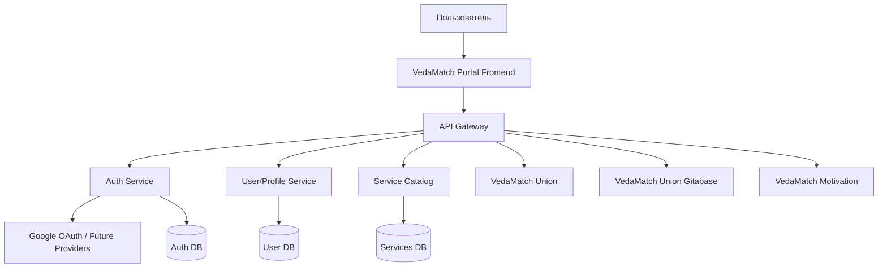
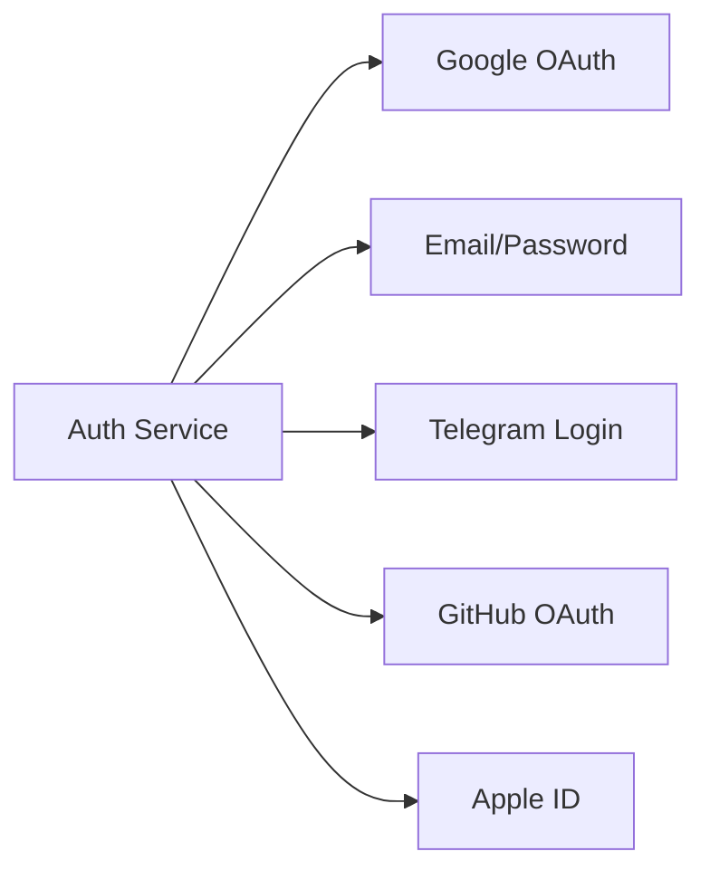

# План портала VedaMatch

## 1. Цель портала

**VedaMatch Portal** — единая точка входа для всех сервисов экосистемы VedaMatch:

- VedaMatch Union
- VedaMatch Union Gitabase
- VedaMatch Motivation
- будущие сервисы VedaMatch

Главная идея: пользователь один раз авторизуется и получает удобный доступ ко всем доступным ему сервисам.

---

## 2. Основные требования

### Пользовательские требования

- Единый вход во все сервисы.
- Авторизация через **Google OAuth** на первом этапе.
- Возможность добавить другие способы авторизации в будущем:
  - email/password;
  - Telegram;
  - Apple ID;
  - GitHub;
  - корпоративный SSO.
- Удобная главная страница со списком сервисов.
- Адаптивный дизайн под:
  - мобильные телефоны;
  - планшеты;
  - десктоп.
- Простая и понятная навигация.
- Отображение только тех сервисов, которые доступны конкретному пользователю.

---

## 3. Архитектура



---

## 4. Основные микросервисы

### 4.1 VedaMatch Portal Frontend

Веб-приложение, через которое пользователь входит в систему и открывает сервисы.

Функции:

- экран входа;
- вход через Google;
- главная страница с карточками сервисов;
- профиль пользователя;
- адаптивный интерфейс;
- отображение доступных сервисов;
- переход в нужный сервис без повторного входа.

### 4.2 API Gateway

Единая точка входа для frontend-приложения.

Функции:

- маршрутизация запросов к микросервисам;
- проверка токенов;
- rate limit;
- централизованное логирование;
- защита внутренних сервисов.

### 4.3 Auth Service

Сервис единой авторизации.

Функции:

- Google OAuth;
- выдача JWT/access token;
- refresh token;
- управление сессиями;
- поддержка будущих провайдеров авторизации;
- logout из всех сервисов;
- единый SSO для всех сервисов VedaMatch.

### 4.4 User/Profile Service

Сервис пользовательских данных.

Хранит:

- имя;
- email;
- avatar;
- роль;
- список доступных сервисов;
- настройки пользователя.

### 4.5 Service Catalog

Сервис каталога приложений VedaMatch.

Хранит информацию о сервисах:

- название;
- описание;
- иконка;
- URL;
- статус сервиса;
- кому доступен сервис;
- категория сервиса.

---

## 5. Единая авторизация

Рекомендуемая схема:

1. Пользователь открывает портал VedaMatch.
2. Нажимает **Войти через Google**.
3. Auth Service получает данные от Google.
4. Создается или обновляется пользователь.
5. Пользователь получает токены.
6. Portal показывает список доступных сервисов.
7. При переходе в сервис токен передается через безопасный SSO-механизм.

Будущая схема провайдеров авторизации:



---

## 6. Дизайн портала

### Общий стиль

- простой;
- чистый;
- современный;
- без перегруженного интерфейса;
- с акцентом на быстрый доступ к сервисам.

### Главная страница

Блоки:

1. Верхняя панель:
   - логотип VedaMatch;
   - имя пользователя;
   - аватар;
   - кнопка выхода.
2. Приветственный блок:
   - “Добро пожаловать в VedaMatch”;
   - короткое описание портала.
3. Сетка сервисов:
   - карточка сервиса;
   - иконка;
   - название;
   - описание;
   - кнопка “Открыть”.
4. Будущие сервисы:
   - отображение в статусе “Скоро”.

---

## 7. Мобильная адаптация

На мобильных устройствах:

- карточки сервисов идут в одну колонку;
- меню сворачивается;
- кнопки крупные и удобные для касания;
- быстрый доступ к профилю;
- минимум лишнего текста;
- авторизация в 1–2 клика.

---

## 8. Безопасность

Нужно предусмотреть:

- HTTPS везде;
- JWT с коротким сроком жизни;
- refresh token в httpOnly cookie;
- защиту от CSRF;
- защиту от XSS;
- ограничение попыток входа;
- централизованный logout;
- аудит входов;
- разделение прав доступа;
- роли: `user`, `admin`, `service-admin`.

---

## 9. Админ-панель

В будущем можно добавить admin-раздел.

Функции:

- управление пользователями;
- управление доступами к сервисам;
- добавление новых сервисов;
- включение/отключение сервисов;
- просмотр логов входа;
- настройка OAuth-провайдеров.

---

## 10. Этапы разработки

### Этап 1 — MVP

- Frontend Portal.
- Google OAuth.
- Auth Service.
- User Service.
- Service Catalog.
- Список сервисов.
- Переход в сервисы.
- Адаптивный дизайн.

### Этап 2 — SSO

- Единая авторизация между сервисами.
- Refresh token.
- Logout из всех сервисов.
- Роли и доступы.

### Этап 3 — Расширение

- Новые способы авторизации.
- Админ-панель.
- Управление сервисами.
- Уведомления.
- Аудит действий.

### Этап 4 — Production

- Мониторинг.
- Логирование.
- Backup.
- CI/CD.
- Защита API.
- Масштабирование микросервисов.

---

## 11. Рекомендуемые компоненты

- **VedaMatch Portal** — frontend-приложение.
- **VedaMatch Auth** — единая авторизация.
- **VedaMatch Gateway** — API Gateway.
- **VedaMatch Users** — пользователи и профили.
- **VedaMatch Services Catalog** — каталог сервисов.
- **VedaMatch Admin** — будущая админ-панель.

---

## 12. Итоговая концепция

**VedaMatch Portal** должен быть центральным, простым и безопасным входом во всю экосистему VedaMatch.

Главный принцип:

> Один аккаунт — один вход — доступ ко всем сервисам VedaMatch.

---

## 13. Самоидентификация пользователя после регистрации

### 13.1 Назначение

После регистрации пользователь проходит самоидентификацию, чтобы портал мог:

- определить его текущий этап пути;
- подобрать подходящие сервисы, проекты, материалы и события;
- управлять доступом к разделам портала;
- помогать пользователю развиваться постепенно;
- подтверждать статус “Преданный” через наставника и администратора.

Важно: этап пользователя — это не ранг и не оценка, а **текущий этап пути**.

### 13.2 Этапы пользователя

#### 1. Ищущий

Человек интересуется самоосознанием, духовностью, смыслом жизни, но пока только начинает путь.

#### 2. Практикующий основы

Человек знаком с базовыми принципами самоосознания и старается применять их в жизни.

#### 3. Йог

Человек регулярно и серьезно практикует, стремится к углублению практики.

#### 4. Преданный

Человек серьезно следует духовной практике, может иметь духовное имя, наставника, связь с общиной и служением.

### 13.3 Как определяется этап

Пользователь **не выбирает этап напрямую**. Он отвечает на вопросы анкеты, а система на основе ответов определяет подходящий этап.

Пример логики:

- ответы начального уровня → **Ищущий**;
- базовая практика и интерес → **Практикующий основы**;
- регулярная серьезная практика → **Йог**;
- наставник, духовное имя, служение, община → **Преданный / кандидат на подтверждение**.

### 13.4 Анкета после регистрации

Примеры вопросов:

1. Как бы вы описали свой интерес к самоосознанию?
2. Есть ли у вас регулярная духовная практика?
3. Что вам сейчас ближе всего?
4. Есть ли у вас наставник?
5. Есть ли связь с духовной общиной?
6. Есть ли у вас духовное имя?
7. Участвуете ли вы в служении?
8. Хотите ли вы получать рекомендации по развитию?

### 13.5 Подтверждение статуса “Преданный”

Статус “Преданный” дает доступ к закрытым сервисам **только после подтверждения администратором**.

Процесс:

1. Пользователь проходит анкету.
2. Система определяет его как “Преданный” или кандидат на этот статус.
3. Пользователь получает уникальную ссылку для наставника.
4. Пользователь отправляет ссылку наставнику.
5. Наставник без регистрации заполняет форму.
6. Система сохраняет данные наставника для связи.
7. Администратор проверяет заявку.
8. После подтверждения пользователь получает доступ к закрытым сервисам.

### 13.6 Форма наставника

Наставник не обязан быть зарегистрирован на портале.

Собираемые данные:

- имя наставника;
- телефон;
- email;
- город/община;
- как давно знает пользователя;
- знает ли пользователя лично;
- есть ли у пользователя регулярная практика;
- есть ли служение;
- есть ли духовное имя;
- есть ли связь с общиной;
- характеристика пользователя;
- рекомендация подтвердить статус;
- подтверждение достоверности данных.

### 13.7 Статусы подтверждения

Для статуса “Преданный”:

- Самоопределен;
- Ожидает наставника;
- Наставник заполнил форму;
- Ожидает администратора;
- Подтвержден;
- Отклонен;
- Требует уточнения.

### 13.8 Доступ к сервисам

В админке у каждого сервиса или контента должны быть галочки видимости:

- Ищущий;
- Практикующий основы;
- Йог;
- Преданный.

Для “Преданного” нужна отдельная настройка:

- показывать самоопределенным преданным;
- показывать только подтвержденным преданным.

Закрытые сервисы открываются только для **подтвержденных преданных**.

### 13.9 История изменений

Нужно хранить историю изменения этапа пользователя.

Сохранять:

- старый этап;
- новый этап;
- дату изменения;
- кто изменил:
  - система;
  - пользователь;
  - администратор;
- причину изменения;
- ответы анкеты;
- статус подтверждения;
- данные заявки наставника, если есть.

### 13.10 Возможность изменить этап

Пользователь может позже пройти самоидентификацию повторно.

В профиле должна быть кнопка:

**Пройти самоидентификацию заново**

Если пользователь уже подтвержден как “Преданный”, повторная анкета не должна автоматически снимать подтверждение. Такие изменения лучше отправлять на проверку администратора.

### 13.11 Админка

#### Раздел “Пользователи”

У пользователя отображается:

- текущий этап;
- статус подтверждения;
- дата последней анкеты;
- история изменений;
- ответы анкеты;
- заявка наставника;
- возможность изменить этап вручную.

#### Раздел “Заявки на подтверждение”

Администратор видит заявки:

- ожидает наставника;
- ожидает администратора;
- подтверждено;
- отклонено;
- требует уточнения.

Администратор может:

- подтвердить;
- отклонить;
- запросить уточнение;
- связаться с наставником.

#### Раздел “Сервисы”

У каждого сервиса есть настройки доступа по типам пользователей.

### 13.12 MVP самоидентификации

Первая версия должна включать:

1. Анкету после регистрации.
2. Автоматическое определение этапа.
3. Четыре этапа:
   - Ищущий;
   - Практикующий основы;
   - Йог;
   - Преданный.
4. Историю изменений этапа.
5. Настройки видимости сервисов по этапам.
6. Подтверждение “Преданного” через ссылку наставнику.
7. Форму наставника без регистрации.
8. Проверку и подтверждение администратором.
9. Открытие закрытых сервисов после подтверждения.

### 13.13 Статус реализации

#### Сделано

- [x] Добавлены общие типы для этапов пользователя, статусов подтверждения, анкеты, истории и заявки наставника.
- [x] Расширена Prisma-схема:
  - этап пользователя;
  - статус подтверждения “Преданный”;
  - ответы анкеты;
  - история изменений этапа;
  - заявки наставника;
  - настройки видимости сервисов по этапам.
- [x] Добавлена SQL-миграция для самоидентификации.
- [x] Добавлен backend-модуль самоидентификации.
- [x] Реализована анкета после регистрации.
- [x] Реализовано автоматическое определение этапа пользователя.
- [x] Реализовано хранение истории изменений этапа.
- [x] Реализована генерация ссылки для наставника.
- [x] Реализована публичная форма наставника без регистрации.
- [x] Реализована базовая админ-проверка заявок наставника.
- [x] Реализовано подтверждение, отклонение и запрос уточнения статуса “Преданный”.
- [x] Реализована фильтрация сервисов по этапу пользователя и статусу подтверждения.
- [x] Обновлен профиль пользователя: отображается этап, статус подтверждения и дата последней анкеты.
- [x] Пользователь без этапа после входа направляется на самоидентификацию.
- [x] Добавлена базовая админ-страница заявок на подтверждение.
- [x] Добавлена страница самоидентификации на frontend.
- [x] Добавлена страница формы наставника на frontend.
- [x] Добавлены фильтры заявок по статусам в админке.
- [x] Добавлен просмотр полной карточки заявки наставника в админке.
- [x] Добавлена кнопка копирования ссылки наставника.
- [x] Добавлен экран “что дальше” после прохождения анкеты.
- [x] Добавлен rate limit для публичной формы наставника.
- [x] Добавлена базовая валидация email и телефона наставника.
- [x] Перенесен Next.js `middleware` на новый `proxy`-формат.
- [x] Настроен `turbopack.root`, чтобы убрать warning сборки о root workspace.
- [x] Проверены `prisma generate`, `prisma validate`, `lint` и `build`.

#### Осталось сделать

- [ ] Применить миграции к рабочей базе данных.
- [ ] Запустить seed для обновления настроек видимости сервисов.
- [ ] Вручную протестировать полный пользовательский сценарий:
  - Google OAuth;
  - первая анкета;
  - определение этапа;
  - ссылка наставника;
  - заполнение формы наставника;
  - проверка администратором;
  - открытие закрытого сервиса после подтверждения.
- [ ] Добавить полноценный админ-раздел “Пользователи”:
  - текущий этап;
  - статус подтверждения;
  - дата последней анкеты;
  - история изменений;
  - ответы анкеты;
  - заявка наставника;
  - ручное изменение этапа.
- [ ] Добавить полноценный админ-раздел “Сервисы” для управления галочками видимости по этапам.
- [ ] Добавить email/Telegram-уведомления пользователю и администратору о статусах заявки.
- [ ] Добавить CSRF-защиту для POST/PATCH-запросов.
- [ ] Добавить аудит действий администратора по заявкам.

---

## 14. Расширение страницы `/profile`

### 14.1 Назначение

Добавить в профиль пользователя необязательные поля, которые пользователь может заполнить по желанию:

- аватар / фото пользователя;
- город постоянного проживания;
- места путешествий и текущее место пребывания;
- социальные сети;
- мессенджеры и контактный телефон.

Все поля должны быть необязательными и редактируемыми в любой момент.

### 14.2 Аватар пользователя

Фото аватара хранить в S3/S3-compatible storage.

Переменные окружения:

```env
S3_ENDPOINT=
S3_REGION=
S3_ACCESS_KEY=
S3_SECRET_KEY=
S3_BUCKET_NAME=
S3_PUBLIC_URL=
```

Правила:

- `S3_ACCESS_KEY` и `S3_SECRET_KEY` использовать только на backend;
- на frontend не передавать секреты S3;
- разрешить форматы `jpg`, `jpeg`, `png`, `webp`;
- ограничить размер файла, например до `5 MB`;
- показывать preview перед сохранением;
- дать возможность заменить или удалить аватар.

Рекомендуемый путь объекта в bucket:

```txt
users/{userId}/avatar.webp
```

В базе хранить:

```ts
profile: {
  avatarUrl?: string
  avatarKey?: string
}
```

API:

```http
POST /profile/avatar
DELETE /profile/avatar
```

### 14.3 Локация и путешествия

Использовать OpenStreetMap для карты и Nominatim для поиска города / reverse geocoding.

Нужно добавить:

- поле “Город проживания”;
- autocomplete поиска города;
- карту с маркером постоянного города;
- список мест путешествий;
- маркер текущего места путешествия;
- возможность добавить несколько городов;
- возможность удалить место из списка.

Важно по privacy:

- не получать геолокацию автоматически;
- показывать кнопку “Определить моё местоположение”;
- запрашивать разрешение браузера только после действия пользователя;
- сохранять город/регион, а не точный адрес;
- при необходимости округлять координаты.

Структура данных:

```ts
profile: {
  homeLocation?: {
    city: string
    country?: string
    lat: number
    lon: number
    displayName?: string
  }

  travelLocations?: Array<{
    city: string
    country?: string
    lat: number
    lon: number
    displayName?: string
    fromDate?: string
    toDate?: string
    isCurrent?: boolean
  }>
}
```

API:

```http
GET /geo/search?q=...
GET /geo/reverse?lat=...&lon=...
PATCH /profile
```

Запросы к Nominatim лучше проксировать через backend, чтобы:

- контролировать rate limit;
- кешировать ответы;
- не светить лишние данные на frontend;
- централизованно обрабатывать ошибки.

### 14.4 Социальные сети

Добавить форму социальных сетей:

- Instagram;
- Telegram;
- X / Twitter;
- Facebook;
- LinkedIn;
- ВКонтакте;
- TikTok;
- YouTube;
- личный сайт.

Структура данных:

```ts
profile: {
  socialLinks?: {
    instagram?: string
    telegram?: string
    x?: string
    facebook?: string
    linkedin?: string
    vk?: string
    tiktok?: string
    youtube?: string
    website?: string
  }
}
```

### 14.5 Мессенджеры и контакты

Добавить отдельный блок “Мессенджеры и контакты”:

- Telegram;
- WhatsApp;
- MX;
- телефон.

Структура данных:

```ts
profile: {
  messengers?: {
    telegram?: string
    whatsapp?: string
    mx?: string
    phone?: string
  }
}
```

Валидация:

- Telegram: `@username` или ссылка `https://t.me/...`;
- WhatsApp: номер телефона или ссылка `https://wa.me/...`;
- телефон: международный формат, например `+7...`, `+1...`;
- соцсети: URL или username;
- MX: уточнить формат перед реализацией, если это не обычная ссылка/username.

### 14.6 MVP реализации `/profile`

Первая версия:

1. Добавить загрузку аватара в S3.
2. Сохранять `avatarUrl` и `avatarKey` в профиле.
3. Добавить форму социальных сетей.
4. Добавить форму мессенджеров и телефона.
5. Добавить город проживания через OpenStreetMap/Nominatim.
6. Добавить базовую карту с маркером города проживания.

Следующая версия:

1. Добавить список путешествий.
2. Добавить текущее место путешествия.
3. Добавить определение местоположения по согласию пользователя.
4. Добавить разные маркеры для дома и путешествий.
5. Добавить privacy-настройки видимости контактных данных и локации.
